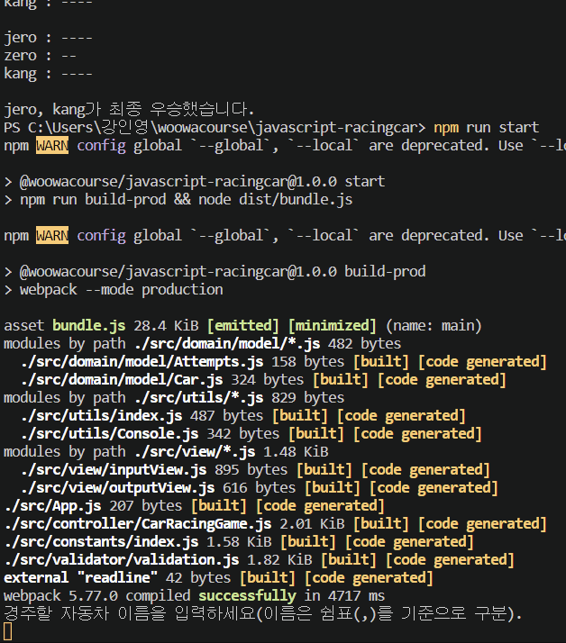

# 🚀프로젝트 이름

<p align="center">
  <h2>Vanilla JS로 구현하는 자동차 경주 게임</h2>
  
  <br>
</p>

## 🔎프로젝트 소개

### 프로젝트 개요

- Vanilla JavaScript로 구현하는 초간단 자동차 경주 게임 어플리케이션

### 실행 방법 (How to Run Application)

1. 필요한 패키지를 설치하기

```
npm install
```

2. 어플리케이션을 실행하기

```
npm run start
```

---

### 어플리케이션 실행 예시

- <p align="center">
    
  </p>

<br>

```
경주할 자동차 이름을 입력하세요(이름은 쉼표(,)를 기준으로 구분).
pobi,crong,honux
시도할 회수는 몇회인가요?
5

실행 결과
pobi : -
crong : -
honux : -

pobi : --
crong : -
honux : --

pobi : ---
crong : --
honux : ---

pobi : ----
crong : ---
honux : ----

pobi : -----
crong : ----
honux : -----

pobi : -----
crong : ----
honux : -----

pobi, honux가 최종 우승했습니다.
```

### 기술 스택

| JavaScript |
| :--------: |
|   ![js]    |

### 프로그래밍 방식

- 페어와 함께 페어 프로그래밍을 진행함.
- 1단계(기능 구현), 2단계(리팩터링) 의 순서로 진행함.
- 각 단계를 수행한 다음 원본 저장소에 pull request를 하고, 리뷰어의 코드 리뷰를 받음.
- [1단계 pr 보러가기](https://github.com/woowacourse/javascript-racingcar/pull/170/files/51efc76f53df1161d8c8559b8f84996a59d69b7e#diff-cb746b0bab6ba3af64f39ac1f1d216da480698ee42d1baea7936e27cc0f322be)
- [2단계 pr 보러가기](https://github.com/woowacourse/javascript-racingcar/pull/244)

---

## ✨구현 기능

1. 경주할 자동차 이름 입력
2. 시도할 횟수 입력
3. 실행 결과 표시
4. 게임 우승자 표시
5. 에러(예외 상황) 표시 및 처리

### 기능 1 - 경주할 자동차 이름 입력

- 콘솔에 자동차들의 이름을 입력한다.
  - 단, 자동차 이름은 쉼표(,)를 기준으로 구분하며 이름은 5자 이하만 가능하다.

### 기능 2 - 시도할 횟수 입력

- 콘솔에 몇 번 이동할 것인지, 시도 횟수를 입력한다.
  - 단, 시도 횟수는 2회 이상 20회 이하만 가능하다.

### 기능 3 - 실행 결과 표시

- 전진하는 자동차를 출력할 때 자동차 이름을 같이 출력한다.
- 전진하는 값을 자동차 이름 옆에 표시한다 (예: pobi: --)
  - 단, 전진하는 조건은 0에서 9 사이에서 무작위 값을 구한 후 무작위 값이 4 이상일 경우이다.

### 기능 4 - 게임 우승자 표시

- 자동차 경주 게임을 완료한 후 우승자 이름을 출력한다.
  - 단, 우승자는 한 명 이상일 수 있다.
  - 우승자가 여러 명일 경우 쉼표(,)를 이용하여 구분한다.

### 기능 5 - 에러(예외 상황) 표시 및 처리

- 사용자가 잘못된 입력 값을 작성한 경우 에러 메시지를 보여주고 다시 입력할 수 있게 한다.
- 입력된 이름이 아래의 경우에 해당한다면 에러 메시지를 보여주고 이름을 재입력하도록 한다.
  - 입력된 자동차 이름들 중 중복된 이름이 있는 경우
  - 이름의 길이가 2 미만 5 초과인 경우
  - 자동차 이름의 개수가 2 미만 20 초과인 경우
  - 이름에 영문자 외의 값이 있는 경우
- 입력된 시도 횟수가 아래의 경우에 해당한다면 에러 메시지를 보여주고 이름을 재입력하도록 한다.
  - 시도 횟수가 정수가 아닌 경우
  - 시도 횟수의 범위가 1회 미만 20회 초과인 경우

<br>

---

## 학습한 것

- 도메인 로직과 UI 로직 분리하기
  - MVC 패턴 적용해보기
- 도메인 로직에 대한 단위 테스트
- [Airbnb 코딩 컨벤션](https://github.com/airbnb/javascript) (코드 스타일 가이드에 맞추어 코드 작성하기)
- 변수 선언 방식(var, let, const)의 차이
- 하드 코딩 지양하기
- early return
- 클래스형 프로그래밍과 함수형 프로그래밍의 차이

## 회고

---

## 라이센스

- [우아한테크코스](https://github.com/woowacourse)

<!-- Stack Icon Refernces -->

[js]: /images/javascript.png
